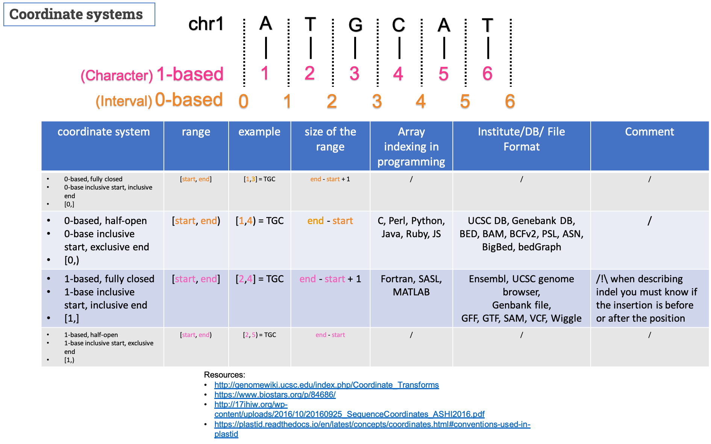

# Coordinate systems
---------------------------
It exists 4 possible coordinate representations but only two are used in genomics: 0-based half-open and 1-based fully closed

Please find below a summary of the topic:

 

