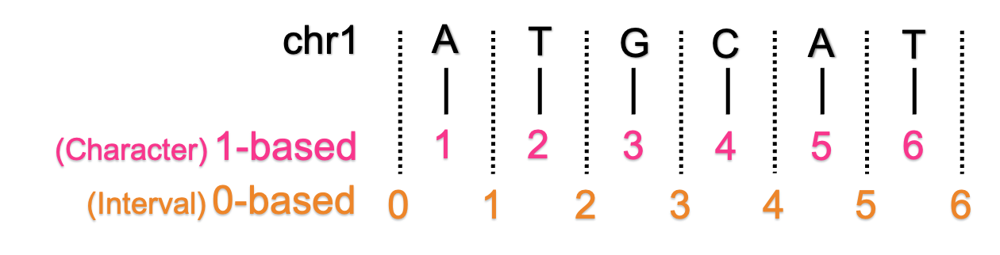

## The coordinate systems 

It exists 4 possible coordinate representations but only two are used in genomics:

 * 0-based half-open
 * 1-based fully closed

Let's dive into the coordinates systems complexity.

| 
 Coordinate system 
	| Range | Example | Size of the range	| Array indexing  in programming | Institute/DB/  File Format | Comment | 
| --- | --- | --- | --- | --- | --- | --- |
| - 0-based, fully closed   - 0-base inclusive start, inclusive end   - [0,] | [start, end] | [1,3] = TGC | end - start + 1 | | | |
| - 0-based, half-open   - 0-base inclusive start, exclusive end   - [0,) | [start, end) | [1,4) = TGC | end - start  | Bash, C, C++, ksh, Go, Haskell, Java, JS, Perl, Python, PowerShell, Ruby, Rust, Scala | UCSC DB, Genebank DB, BED, BAM, BCFv2, PSL, ASN, BigBed, bedGraph, GA4GH; HML 1.0 | |
| - 1-based, fully closed   - 1-base inclusive start, inclusive end   - [1,] | [start, end] | [2,4] = TGC | end - start + 1 | AWK, COBOL, Fortran, Julia, Lua, MATLAB, R, sh, XPath/Xquery, zsh | Ensembl, UCSC genome browser, Genbank file, GFF, GTF, SAM, VCF, Wiggle, GenomicRanges, BLAST, GenBank/EMBL Feature Table, HGVS | /!\ when describing indel you must know if the insertion is before or after the position |
| - 1-based, half-open   - 1-base inclusive start, exclusive end   - [1,) | [start, end) | [2,5) = TGC | end - start  |

## Interval types

I like this visual explaining the interval types. Credits is from [UCSC Genome Browser Blog](https://genome-blog.soe.ucsc.edu/blog/2016/12/12/the-ucsc-genome-browser-coordinate-counting-systems/)

