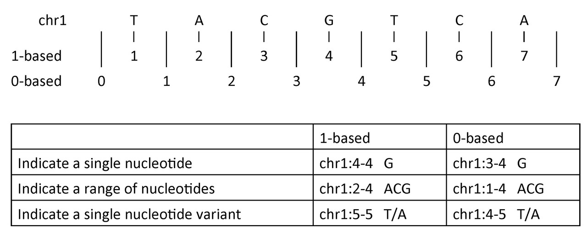
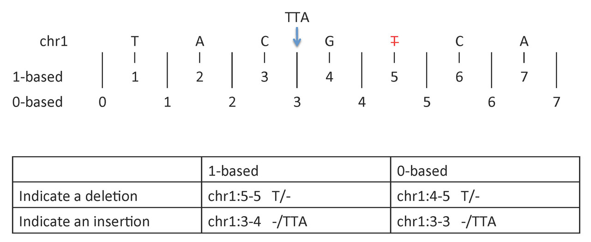

## Variant representation depending the coordinate system

Obi Griffith, a professor of Medicine (Oncology) and Genetics at Washington University made a realy nice cheat sheet about it and shared it via biostars.org [here](https://www.biostars.org/p/84686/).

### Single nucleotide variant

* 1-based coordinate system  
Single nucleotides, variant positions, or ranges are specified directly by their corresponding nucleotide numbers  

* 0-based coordinate system  
Single nucleotides, variant positions, or ranges are specified by the coordinates that flank them

### Insertion or deletion 

* 1-based coordinate system
    * Deletions are specified directly by the positions of the deleted bases
    * Insertions are indicated by the coordinates of the bases that flank the insertion  

* 0-based coordinate system
    * Deletions are specified by the coordinates that flank the deleted bases
    * Insertions are indicated directly by the coordinate position where the insertion occurs

**Difficulties**

table inspired from Bob Milius [presentation](http://17ihiw.org/wp-content/uploads/2016/10/20160925_SequenceCoordinates_ASHI2016.pdf).  

| Character / 1-based | Interval / 0-based | 
| --- | --- |
| When describing an indel at a specific position you must know if the insertion is before or after that position. HGVS and VCF have different rules in describing variants | insertions are easily described, it happens in the space between the positions |

## Normalization

Variant representation is non-unique for variants that have explicitly expressed reference and alternate sequences. A failure to recognize this will frequently result in inaccurate analyses.
The normalization of a variant representation is necessary. A common way is “trimming” and “shifting”.

Taking the example below, the Multi Nucleotide Polymorphism (MNP) is represented superfluously for the first 3 representations and parsimoniously for the 4th representation. When a variant has superfluous nucleotides on the left side, it is defined as not being left parsimonious as there is a need to left trim. The concept is symmetric for right parsimony and trimming. Parsimony applies to Indels too which we shall demonstrate in the left alignment section.

(from [wikipedia page](https://genome.sph.umich.edu/wiki/Variant_Normalization))

A simple variant definition (after maximal “trimming”) that cannot be further shifted left is referred to as “left‐aligned”; similarly, a simple variant definition that cannot be shifted right is referred to as “right‐aligned.”
See figure below for an exampple:  

(from https://www.ncbi.nlm.nih.gov/pmc/articles/PMC6519371/)

* HGVS uses right-aligned
* VCF uses left-aligned
* SPDI format does not use any of them.

## Formats

From https://github.com/ga4gh/vrs/issues/305  
See also https://vrs.ga4gh.org/en/stable/appendices/relationships.html#relationships

### HGVS

The HGVS nomenclature recommendations describe how sequence variation should be presented to human beings. In addition to representing a wide variety of sequence changes from single residue variation through large cytogenetic events, HGVS attempts to also encode in strings notions of biological mechanism (e.g., inversion as a kind of deletion-insertion event), predicted events (e.g., parentheses for computing protein sequence), and complex states (e.g., mosaicism). In practice, HGVS recommendations are difficult to implement fully and consistently, leading to ambiguity in presentation. In contrast, the VRS is a formal specification that improves consistency of representation among computer systems. VRS is currently less expressive than HGVS for rarer cases of variation, such as cytogenetic variation or context-based allele representations (e.g., insT written as dupT when the insertion follows a T). Future versions of the specification will seek to address limitations while preserving principles of conceptual clarity and precision.

* HGVS is a nomenclature. HGVS is designed primarily for human-readability not computational identification. HGVS is not applied consistently in reporting, literature, and databases even though there has been great strides to provide tooling to validate HGVS syntax. HGVS does not normalize variation using VOCA. Several HGVS expressions can represent the same variant. VRS is not designed to be human-readable (we have started designing implementation guidance for wrapping VRS representations in Value Object Descriptors to allow exchange systems to add human-readable and useful attributes that improve the productivity of data exchange contracts involving variation - see VRSATILE).

### VCF

The Variant Call Format (VCF) is the de facto standard for representing alleles, particularly for use during primary analysis in high-throughput sequencing pipelines. VCF permits a wide range of annotations on alleles, such as quality and likelihood scores. VCF is a file-based format and is exclusively for genomic alleles. In contrast, the VRS data model abstractly represents Alleles, Haplotypes, and Genotypes on all sequence types, is independent of medium, and is well-suited to secondary analyses, allele interpretation, aggregation, and system-level interoperability.

* VCF is genomic only. VCF is a file format. VCF is primarily designed for high-volume, compact variant calls. VCF is not designed to be extensible in the same way as VRS to support much broader representations of variation independent of samples or cohorts. VCF does not normalize the small precise SNVs and DelInss using the same VOCA based normalization.

### SPDI

The SPDI format created to represent alleles in NCBI’s Variation Services has four components: the sequence identifier, which is specified with a sequence accession and version; the 0-based inter-residue coordinate where the deletion starts; the deleted sequence (or its length) and the inserted sequence. The Variation Services return the minimum deleted sequence required to avoid over precision. For example, a deletion of one G in a run of 4 is specified with deleted and inserted sequences of GGGG and GGG respectively, avoiding the need to left or right shift the minimal representation. This reduces ambiguity, but can lead to long allele descriptions.

* SPDI is only about alleles and precise genomic variation, SPDI’s nomenclature is built on VOCA (variant overprecision correction algorithm) as specified by NCBI. VRS is built on VOCA as well for the types of variation that fall within its domain.

### VRS 

Variation Representation Specification (VRS) is made by GA4GH and try to unify disparate efforts to represent biological sequence variation in order to avoid “reinventing the wheel”.
VRS is being designed as an informational model that is designed as atomic building blocks that can be composed into higher order variant representations. It is designed for the primary function of precise computational data exchange.

* VRS is extensible. It is not limited to simple SNVs, DelIns and any subset of variation and such can be used as a standard that will grow with the types of variation that are often limited by other methods, nomenclatures and authorizing registries (SPDI, VCF and HGVS)
* VRS is not limited to genomic sequence, but any type of sequence (genomic, transcript, protein).
* VRS is not limited to sequence based variation (cytobands, systemic expression, genetic features)